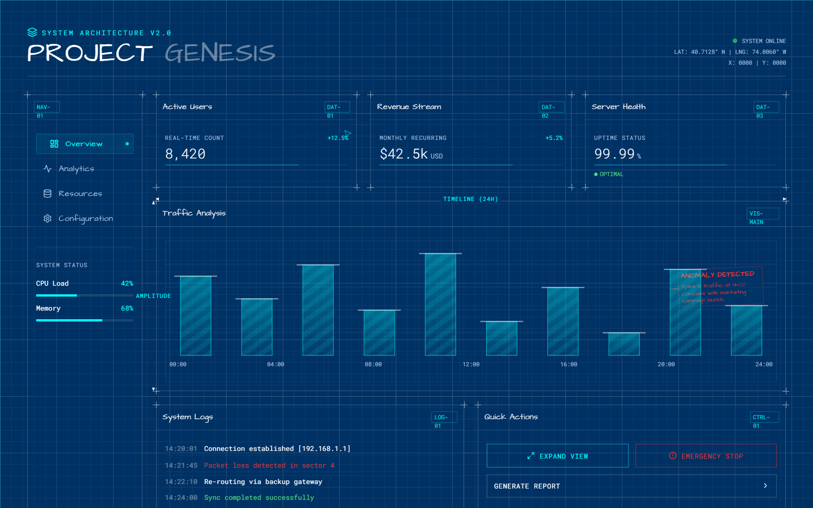

# Design Style: Architectural Blueprint

> **Source:** [SuperDesign — Architectural Blueprint](https://app.superdesign.dev/library/architectural-blueprint)
> **Author:** Zhou Jason
> **Vibe:** A technical, architectural blueprint style dashboard with grid systems, measurement markers, and dra...

## Reference Images

> 이 프롬프트를 사용하면 아래와 같은 스타일로 결과물이 나옵니다.

---

<design-system>

## Design Style: Architectural Blueprint

### Description

A technical, architectural blueprint style dashboard with grid systems, measurement markers, and drafting aesthetics.

---

### Reference Implementation

The full HTML reference for this style is stored separately.

**Key Visual Characteristics (from description):**

A technical, architectural blueprint style dashboard with grid systems, measurement markers, and drafting aesthetics.

</design-system>