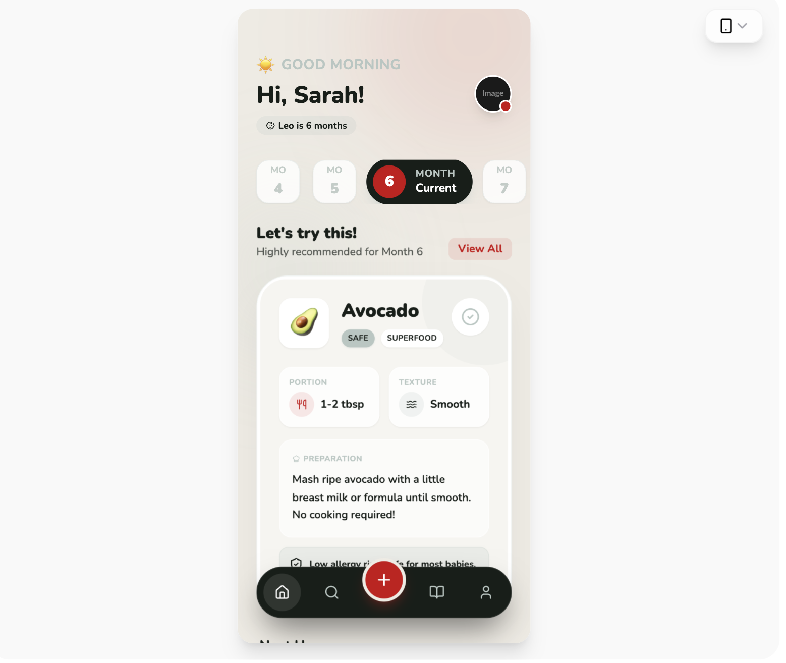

# Design Style: BabyBites - Sophisticated Palette

> **Source:** [SuperDesign — BabyBites - Sophisticated Palette](https://app.superdesign.dev/library/babybites-sophisticated-palette)
> **Author:** Shirley Lou
> **Vibe:** A refined, modern parenting and health-focused design system using high-contrast colors (#171e19, #c...

## Reference Images

> 이 프롬프트를 사용하면 아래와 같은 스타일로 결과물이 나옵니다.

---

<design-system>

## Design Style: BabyBites - Sophisticated Palette

### Summary

A refined, modern parenting and health-focused design system using high-contrast colors (#171e19, #ca0013) paired with soft backgrounds (#eeebe3) and sage accents (#b7c6c2). The design balances playfulness through rounded iconography and typography with professional reliability through structured information grids.

---

### Style

The style is defined by its 'Sophisticated Playful' aesthetic. It uses Nunito as its primary typeface across all weights (400-900) to create clear hierarchy. The color palette uses Charcoal (#171e19) for primary text and backgrounds, Vibrant Red (#ca0013) for high-impact CTAs, and Gray-Green (#b7c6c2) for borders and secondary labels. Soft shadows (0_20px_50px_-12px_rgba(0,0,0,0.08)) and glassmorphism-lite effects on cards create depth.

**Core Prompt:**

Apply a sophisticated color palette: Charcoal (#171e19), Gray-Green (#b7c6c2), Vibrant Red (#ca0013), Off-White (#eeebe3), and White (#ffffff). Typography: Use 'Nunito' for all text; Headings at 32px/Font-Black, Subheadings at 20px/Font-Black, Labels at 10px/Font-Bold with uppercase tracking. UI Elements: Use border-radius of 40px (2.5rem) for main cards and 24px (1.5rem) for nested items. Borders should be 1px solid #b7c6c2 at 20-30% opacity. Animations: Implement view-transitions with a 0.25s ease-in/out fade. Buttons: Primary CTAs in Red, secondary in White with gray-green borders. Shadows: Use subtle large-spread shadows for depth.

---

### Layout & Structure

A mobile-first, single-column layout with a fixed floating navigation bar. The structure prioritizes contextual discovery via a horizontal scrollable selector and a high-impact hero section for primary content.

#### Header

Top-aligned header with 56px top padding. Left side: Greeting text using a 12px uppercase label in #b7c6c2 and a 30px bold name in #171e19. Right side: 48px circular profile image with a 2px white border and a 16px red notification badge at the bottom-right.

#### Horizontal Scroll Selector

Horizontal snap-scrolling list of category buttons. Inactive state: 56x56px white square with 16px radius, #b7c6c2/30 border. Active state: 160px wide pill in #171e19, featuring an internal 40px red circle for the value, and white text for status labels.

#### Hero Feature Card

Large white card with 40px (2.5rem) radius and subtle shadow. Contains: 1. A semi-transparent decorative blob (#b7c6c2/20) in the top-right. 2. A 64x64px white square icon holder with an emoji. 3. Nested 2-column grid for metrics (Portion, Texture) using white-glass cards (80% opacity) with 16px radius. 4. An alert/info box at the bottom using #b7c6c2/20 background.

#### Secondary Feed Items

Vertical list of cards with 24px radius, white background, and #b7c6c2/30 border. Features a 56px icon container with a 10% opacity color background, 18px bold headings, and a circular trailing checkbox button (40px) that changes to red on hover.

#### Floating Navigation

Fixed bottom-aligned pill (8px from bottom edges) in #171e19. 1. Height: 64px. 2. Center Action: 56px red circle button offset vertically (floating 32px above the bar) with a 4px #eeebe3 border. 3. Icons: 48px touch targets, white icon for active state, #b7c6c2 for inactive.

---

### Special UI Components

#### Floating Center Action Button

*A high-visibility floating action button (FAB) integrated into the navigation bar.*

Create a 56px circular button using #ca0013. Offset it vertically by -32px so it sits half-outside its parent container. Add a 4px solid border of #eeebe3 (matching the background) to create a 'cutout' visual effect. Include a white icon and a red shadow (shadow-red/30).

#### Bento Metric Card

*Small information cards used for displaying specific data points within a larger section.*

A 16px rounded card with a background of white at 80% opacity and a backdrop-blur filter. Padding: 12px. Title: 10px uppercase, #b7c6c2. Content: 14px bold #171e19 with a leading 32px circular icon in #ca0013 at 10% opacity.

---

### Special Notes

MUST use #ca0013 exclusively for actions and critical alerts to maintain its semantic weight. MUST NOT use pure black; always substitute with #171e19 Charcoal. MUST maintain the oversized 40px border-radius on main containers to preserve the signature 'soft but modern' look. MUST ensure all icons are visually balanced within circular or square containers.

</design-system>