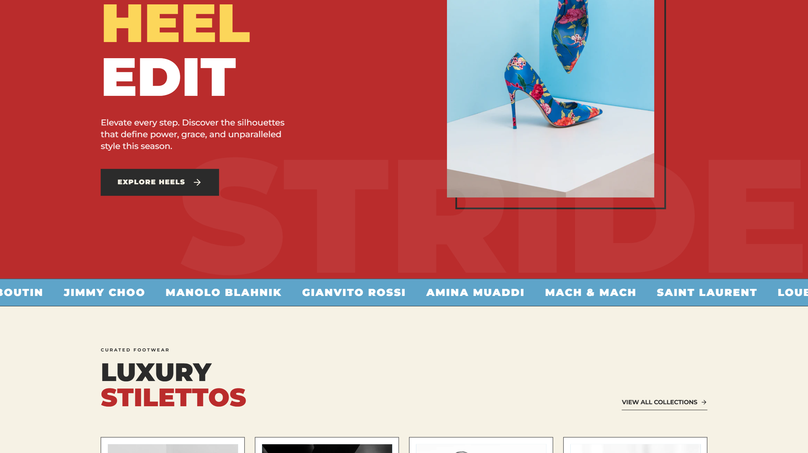

# Design Style: Bold Retro-Modernism

> **Source:** [SuperDesign — Bold Retro-Modernism](https://app.superdesign.dev/library/bold-retro-modernism)
> **Author:** Zhou Jason
> **Vibe:** A striking, high-contrast editorial design system blending 1970s retro aesthetics with modern brutal...

## Reference Images

> 이 프롬프트를 사용하면 아래와 같은 스타일로 결과물이 나옵니다.

---

<design-system>

## Design Style: Bold Retro-Modernism

### Summary

A striking, high-contrast editorial design system blending 1970s retro aesthetics with modern brutalist layouts, featuring bold primary colors and massive, tightly-spaced typography.

---

### Style

The style relies on a rigid color palette: Retro Red (#BC2C2C), Vintage Blue (#5DA4C9), and Sunny Yellow (#FCD758), grounded by a Warm Beige (#F5F1E3) and a deep Charcoal Text (#2C2C2C). Typography is split between Montserrat for heavy, aggressive headlines (weights 700-900) and Open Sans for clean, functional body text. Key visual motifs include 12px-20px solid offset borders, infinite scrolling marquees, and grayscale-to-color image transitions.

**Core Prompt:**

Apply a Bold Retro-Modernist aesthetic. 
- **Color Palette**: Primary Red (#BC2C2C), Secondary Blue (#5DA4C9), Accent Yellow (#FCD758), Background Beige (#F5F1E3), and Deep Charcoal (#2C2C2C) for all text/borders.
- **Typography**: 
  - Headlines: Montserrat, 700-900 weight, line-height: 0.85, letter-spacing: -0.05em, uppercase.
  - Body: Open Sans, 400-600 weight, line-height: 1.6.
  - Utility labels: Open Sans, font-size: 10px, weight: 900, letter-spacing: 0.1em, uppercase.
- **Borders & Shadows**: No soft shadows. Use solid 'editorial shadows' (20px offset, #2C2C2C) or heavy borders (12px solid #2C2C2C).
- **Images**: Default to grayscale (filter: grayscale(100%)) with a 500ms ease-in-out transition to full color on hover.
- **Micro-interactions**: Use 'view-transition: same-origin' for smooth page changes and linear infinite scrolling for marquee elements.

---

### Layout & Structure

The layout uses a block-heavy structure with high-contrast section changes. It alternates between full-bleed primary color backgrounds and neutral beige sections to maintain visual rhythm.

#### Navigation

Sticky header with background color #BC2C2C. Left-aligned logo in Montserrat Black. Navigation links in 10px uppercase tracking-widest (letter-spacing: 0.15em). Right-aligned icons for search and cart, featuring a badge for cart items (white circle, #BC2C2C text, font-size: 8px).

#### Hero Section

Full-bleed #BC2C2C background. Features massive background text ('STRIDE') at font-size: 25vw, opacity: 0.08, right-aligned. Main headline: Montserrat 9xl, uppercase, line-height: 0.85. Hero image should be contained in a #5DA4C9 container with a solid #2C2C2C offset border (16px translate-x/y). CTA button: black background, white text, 12px font, uppercase, tracking-widest.

#### Brand Ticker

Infinite horizontal scrolling marquee. Background: #5DA4C9. Top/bottom borders: 2px solid #2C2C2C. Text: Montserrat, 18px, white, uppercase, letter-spacing: 0.2em. Animation: linear translate-x from 0 to -50% over 40 seconds.

#### Product Grid

Section background: #F5F1E3. Header with subtitle (10px uppercase) and main title (5xl, Montserrat). Grid: 4 columns. Cards: white background, light gray border, grayscale images that turn color on hover. Metadata: top row with brand (10px gray uppercase) and price (10px bold), bottom row with product name (14px black uppercase).

#### Editorial Section

Two-pane container with a 12px solid #2C2C2C border. Left pane: #F5F1E3 background, 1/3 width, vertical stack of headline and a circular arrow button. Right pane: White background, 2/3 width, featuring a centered grayscale image (20% opacity) as a watermark, with a bottom-left aligned 5xl headline and black CTA button.

#### Footer

Background #2C2C2C, text white. Two-column main layout. Left: Massive brand name (7xl) and social links. Right: 3-column sub-grid for site links. Footer labels in #FCD758 (10px uppercase). Bottom bar: 1px border-top (white/10 opacity), 8px font-size legal text, all uppercase.

---

### Special UI Components

#### Editorial Offset Card

*A container with a faux-shadow created by a solid border-only div behind the main content.*

Create a container with a relative parent. Add an absolute-positioned div with a 2px solid #2C2C2C border, offset by 16px (translate-x: 16px, translate-y: 16px). Place the main content div (background color #5DA4C9) on top with a higher z-index.

#### Large Background Watermark Text

*Hero-level text that creates texture without hindering readability.*

Position a text element using 'absolute', bottom: 0, right: 0. Font: Montserrat 900, size: 25vw, line-height: 0.8. Color: white with 0.08 opacity (or 8% alpha). Set 'pointer-events: none' and 'letter-spacing: -0.05em'.

---

### Special Notes

MUST-DO: Use primary colors in their purest hex forms for maximum impact. MUST-DO: Ensure all typography uses tight leading (line-height < 1.0) for large headlines. MUST-NOT: Use rounded corners or soft drop shadows; all edges should be 90-degree angles and shadows should be solid color offsets. MUST-NOT: Use lowercase in labels or headings; reserve sentence case strictly for long-form paragraphs.

</design-system>