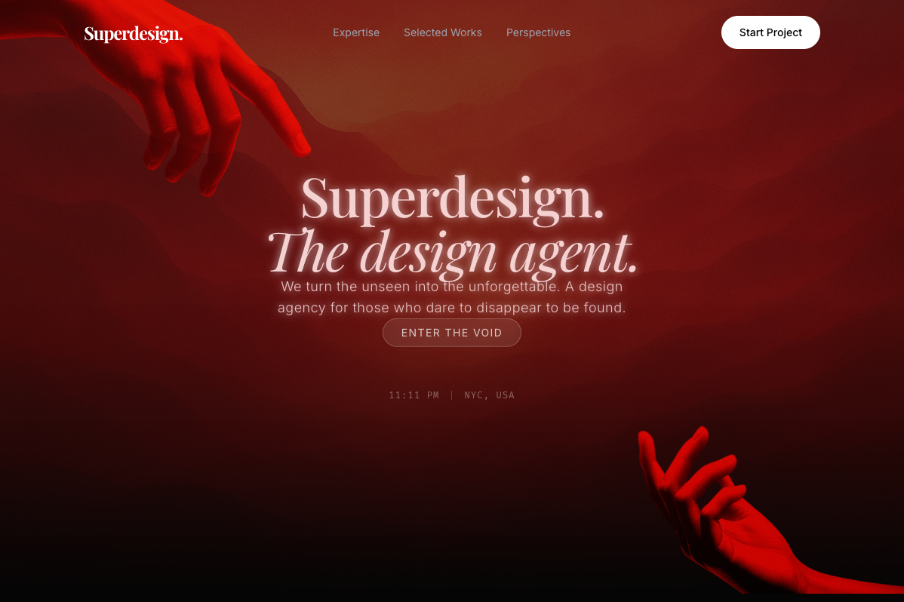

# Design Style: Deep Red Style

> **Source:** [SuperDesign — Deep Red Style](https://app.superdesign.dev/library/deep-red-style-5b01cb)
> **Author:** Zhou Jason
> **Vibe:** A deep red/orange atmospheric gradients, elegant serif typography, and complex scroll-triggered anim...

## Reference Images

> 이 프롬프트를 사용하면 아래와 같은 스타일로 결과물이 나옵니다.

---

<design-system>

## Design Style: Deep Red Style

### Description

A deep red/orange atmospheric gradients, elegant serif typography, and complex scroll-triggered animations, with floating parallax cards and a dot-grid background.

---

### Reference Implementation

The full HTML reference for this style is stored separately.

**Key Visual Characteristics (from description):**

A deep red/orange atmospheric gradients, elegant serif typography, and complex scroll-triggered animations, with floating parallax cards and a dot-grid background.

</design-system>