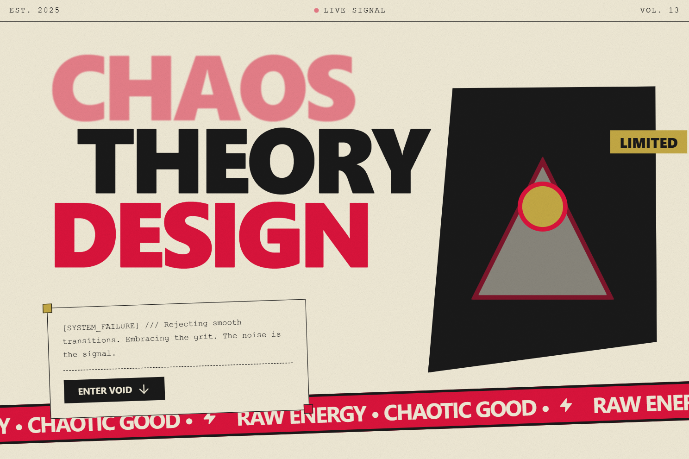

# Design Style: Grunge Collage Motion

> **Source:** [SuperDesign — Grunge Collage Motion](https://app.superdesign.dev/library/grunge-collage-motion)
> **Author:** Zhou Jason
> **Vibe:** A high-energy, distressed collage style featuring raw textures, fragmented composition, and jittery ...

## Reference Images

> 이 프롬프트를 사용하면 아래와 같은 스타일로 결과물이 나옵니다.

---

<design-system>

## Design Style: Grunge Collage Motion

### Description

A high-energy, distressed collage style featuring raw textures, fragmented composition, and jittery stop-motion animation. Implements the 'Grunge Collage Motion Graphics' design system with bold typography and glitch effects.

---

### Reference Implementation

The full HTML reference for this style is stored separately.

**Key Visual Characteristics (from description):**

A high-energy, distressed collage style featuring raw textures, fragmented composition, and jittery stop-motion animation. Implements the 'Grunge Collage Motion Graphics' design system with bold typography and glitch effects.

</design-system>