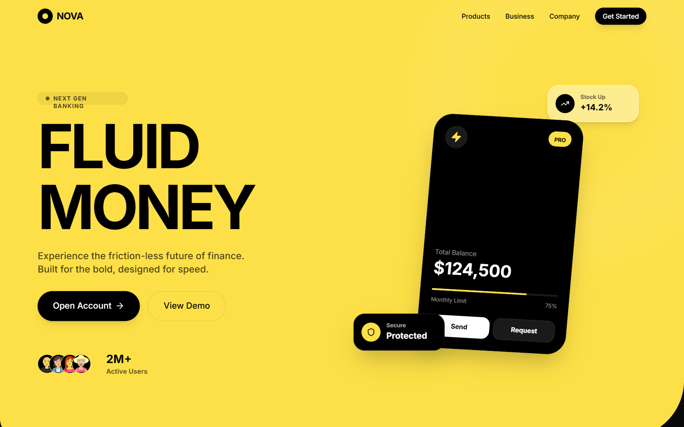

# Design Style: Hyper-Saturated Fluid

> **Source:** [SuperDesign — Hyper-Saturated Fluid](https://app.superdesign.dev/library/hyper-saturated-fluid)
> **Author:** Zhou Jason
> **Vibe:** A landing page featuring a Hyper-Saturated Fluid design style. It uses a 'Cyber Yellow' primary colo...

## Reference Images

> 이 프롬프트를 사용하면 아래와 같은 스타일로 결과물이 나옵니다.

---

<design-system>

## Design Style: Hyper-Saturated Fluid

### Description

A landing page featuring a Hyper-Saturated Fluid design style. It uses a 'Cyber Yellow' primary color with organic 'liquid' sectioning, contrasting against a 'Deep Onyx' dark void. Includes glassmorphic data cards, massive typography, and pill-shaped interactive elements.

---

### Reference Implementation

The full HTML reference for this style is stored separately.

**Key Visual Characteristics (from description):**

A landing page featuring a Hyper-Saturated Fluid design style. It uses a 'Cyber Yellow' primary color with organic 'liquid' sectioning, contrasting against a 'Deep Onyx' dark void. Includes glassmorphic data cards, massive typography, and pill-shaped interactive elements.

</design-system>