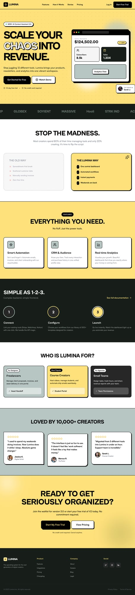

# Design Style: Lumina — Neo-Brutalist SaaS

> **Source:** [SuperDesign — Lumina SaaS Landing Page](https://app.superdesign.dev/library/lumina-saas-landing-page)
> **Author:** Shirley Lou
> **Vibe:** Bold, energetic, high-contrast, playful confidence

## Reference Images

> 이 프롬프트를 사용하면 아래와 같은 스타일로 결과물이 나옵니다.



---

<design-system>

## Design Style: Lumina — Neo-Brutalist SaaS Landing Page

### Summary

A vibrant Neo-Brutalist SaaS landing page utilizing a dominant `#ffe17c` yellow, deep charcoal `#171e19`, and sage `#b7c6c2` accents. It features high-contrast black borders, hard offset shadows, and bold geometric typography to convey professional confidence with a playful edge.

---

### Style

The style is a modern take on Neo-Brutalism. Typography pairs the high-impact 'Cabinet Grotesk' (weights 400-800) for headings with 'Satoshi' for readability. The palette uses `#ffe17c` as a primary background, balanced by `#171e19` charcoal and `#b7c6c2` sage. Visual elements are defined by 2px solid black borders and 4px-8px hard shadows (no blur). Micro-interactions involve 'translate' effects on hover where buttons move 4px to 'fill' their shadow space.

**Core Prompt:**

Create a design based on Neo-Brutalist principles.

**Colors:**
- Primary: `#ffe17c` (Yellow)
- Background: `#171e19` (Charcoal)
- Accent: `#b7c6c2` (Sage)
- UI: `#ffffff` (White)
- Text: `#000000` (Black)

**Typography:**
- Headings: 'Cabinet Grotesk' (Extrabold, tracking-tighter)
- Body: 'Satoshi' (Medium, 500)

**UI Elements:**
- Use 2px solid black borders on all cards, buttons, and sections
- Implement 'Hard Shadows':
  - Standard: `box-shadow: 4px 4px 0px 0px #000000`
  - Large containers: `box-shadow: 8px 8px 0px 0px #000000`
- Buttons hover state: `transform: translate(4px, 4px)` + remove shadow (simulates physical press)
- Include a 32px × 32px radial dot pattern (opacity 10%) on primary yellow backgrounds

---

### Layout (9 Sections)

A vertically stacked landing page with high-contrast section transitions. Moves from a high-energy yellow hero → dark charcoal social proof bar → white/yellow feature grids → dark-mode 'how it works' flow.

1. **Navigation** — Fixed/sticky, black background, yellow CTA button
2. **Hero Section** — Yellow background, massive bold headline, browser mockup dashboard
3. **Social Proof Marquee** — Dark charcoal bar, scrolling logos/stats
4. **Problem vs Solution** — White section, side-by-side comparison
5. **Feature Grid** — Bento-style asymmetric card layout
6. **How It Works** — Dark mode step-by-step (1-2-3), numbered circles
7. **Use Case Personas** — Segmented audience cards with role tags
8. **Testimonials** — Quote cards with hard shadows
9. **Final CTA & Footer** — Yellow CTA section + dark footer grid

---

### Components

#### Neo-Brutalist Push Button

A high-contrast button that visually 'depresses' when hovered or clicked.

```css
background-color: #000;
color: #fff;
padding: 1rem 2rem;
border: 2px solid #000;
border-radius: 0.75rem;
box-shadow: 8px 8px 0px 0px #000;
transition: all 0.2s cubic-bezier(0.175, 0.885, 0.32, 1.275);
```

**Hover:**
```css
transform: translate(4px, 4px);
box-shadow: none;
```

#### Browser Mockup Dashboard

A stylized application UI container for marketing visuals.

```css
background: white;
border: 2px solid black;
border-radius: 1rem;
box-shadow: 12px 12px 0px black;
```

Header bar: background black, contains three small colored circles:
- Red: `#ff5f57`
- Yellow: `#febc2e`
- Green: `#28c840`

---

### Key Design Principles

1. **Zero blur** — All shadows are hard offset, no `blur` radius
2. **2px borders everywhere** — Cards, buttons, inputs, sections
3. **Physical press simulation** — Hover = translate to shadow offset = removes shadow
4. **Yellow dominance** — `#ffe17c` is the primary visual driver, not just an accent
5. **Bento grids** — Asymmetric card layouts, no perfect 50/50 splits
6. **Marquee animations** — Scrolling social proof / stats bars
7. **Dot patterns** — Radial dot texture on yellow backgrounds for depth

</design-system>
