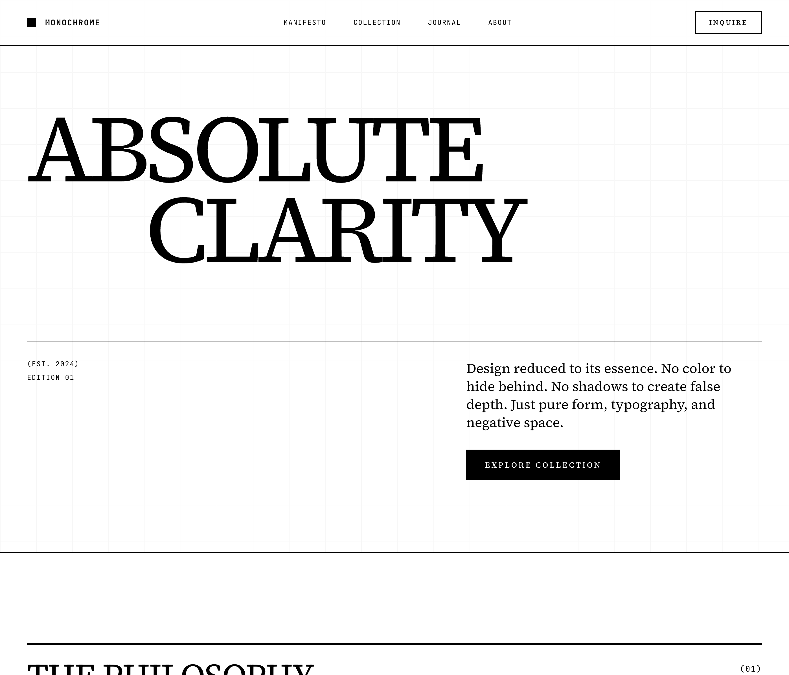

# Design Style: Monochrome

> **Source:** [SuperDesign — Monochrome](https://app.superdesign.dev/library/monochrome)
> **Author:** Zhou Jason
> **Vibe:** # Minimalist Monochrome

Source: designprompt.dev...

## Reference Images

> 이 프롬프트를 사용하면 아래와 같은 스타일로 결과물이 나옵니다.

---

<design-system>

## Design Style: Monochrome

### Description

# Minimalist Monochrome

Source: designprompt.dev

---

### Reference Implementation

The full HTML reference for this style is stored separately.

**Key Visual Characteristics (from description):**

# Minimalist Monochrome

Source: designprompt.dev

</design-system>