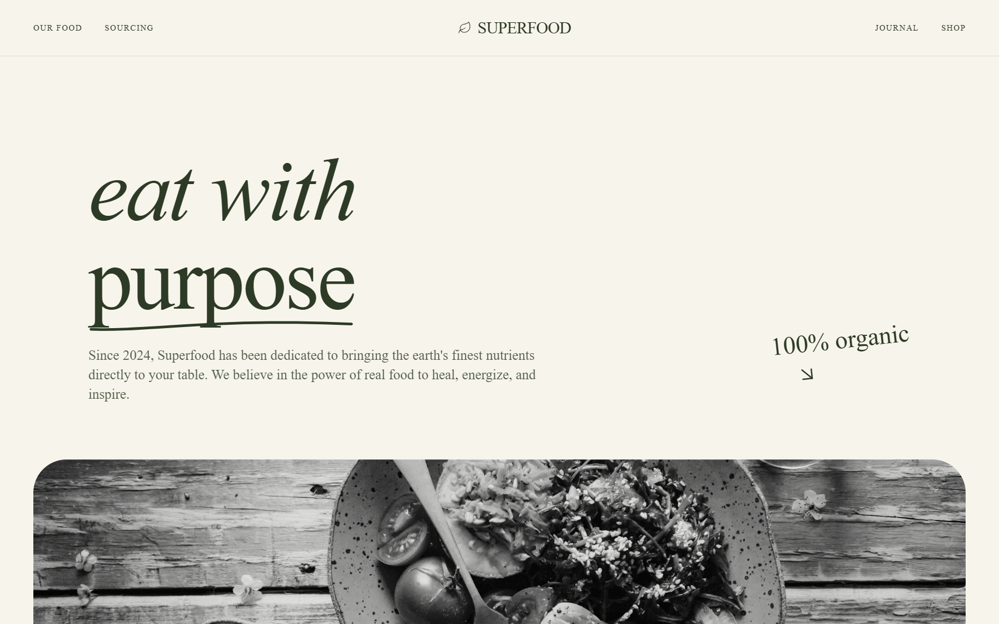

# Design Style: Organic Modern Style

> **Source:** [SuperDesign — Organic Modern Style](https://app.superdesign.dev/library/organic-modern-style)
> **Author:** Zhou Jason
> **Vibe:** A refined, editorial-style interface that balances technological precision with human-centric organi...

## Reference Images

> 이 프롬프트를 사용하면 아래와 같은 스타일로 결과물이 나옵니다.

---

<design-system>

## Design Style: Organic Modern Style

### Summary

A refined, editorial-style interface that balances technological precision with human-centric organic elements, defined by its high-contrast serif typography and soft, paper-like textures.

---

### Style

The style essence is 'Modern Organic Editorial.' It pairs a deep charcoal (#202A2D) with a warm cream base (#F7F5EB) and sage accents (#CBD0B5). Typography is a mix of high-contrast serifs for impact and clean sans-serifs for utility. Visual interest is generated through subtle noise textures, hand-drawn SVG flourishes, and large-radius container corners (40px-64px). Animations are deliberate, focusing on upward fades and smooth scaling.

**Core Prompt:**

Style Guide Specification:
- **Colors**: Primary Background: #F7F5EB; Primary Text: #202A2D; Accent Color (Sage): #CBD0B5; Secondary Background: #F0EDE1. 
- **Typography**: 
  - Headings: 'DM Serif Display', weights 400 (normal) and 400 (italic). Sizes ranging from 48px to 160px. Leading: 0.85 to 1.1.
  - Body/UI: 'Inter', weights 300, 400, 500. UI labels should use uppercase with 0.2em to 0.3em tracking, size 10px.
  - Accents: 'Reenie Beanie' (handwritten) at 48px for annotations.
- **Texture**: Apply a subtle noise overlay using a natural paper texture pattern at 0.4 opacity as a fixed global layer.
- **Borders & Radii**: Use large border-radius (40px-64px) for main image containers. UI buttons use full pill-shape (999px).
- **Animations**: 
  - Text Entry: `translateY(20px)` to `translateY(0)` with opacity 0 to 1 over 0.8s (ease-out).
  - Image Hover: Transition from grayscale(100%) to grayscale(0%) and scale(1.05) over 2000ms.
- **Interactions**: Buttons transition from charcoal background to sage background on hover.

---

### Layout & Structure

A vertical-scrolling layout with distinct sections including a spacious hero, high-impact media blocks, staggered grids, and horizontal-scrolling galleries.

#### Navigation

Sticky top-0 bar with `backdrop-blur-md` and 80% opacity of #F7F5EB. Height approx 80px. Left side contains logo (Icon + Serif text) and uppercase menu items (10px, 0.2em tracking). Right side features a pill-shaped 'Get Started' button in #202A2D.

#### Hero Section

Massive serif heading (up to 160px) with italicized first line. One word should be underlined with a custom hand-drawn SVG stroke (color #CBD0B5). Subtext is 24px Inter, max-width 650px, with a 200ms animation delay. Right-aligned 'handwritten' annotation with a downward arrow icon.

#### Hero Image Block

Full-width section with 24px-48px side padding. Image container has 64px border-radius, height 80vh. Features a bottom-left overlay including a horizontal rule (48px wide), uppercase label, and a secondary italicized serif heading (72px).

#### Team Grid

Staggered grid layout. Cards consist of an aspect-ratio 4:5 grayscale image with 24px border-radius. On hover, image turns to color. Use asymmetrical vertical alignment (e.g., column 2 and 4 are shifted down by 48px).

#### Horizontal Process Gallery

A section featuring a header with navigation arrows (chevron-left/right). The content area is a horizontal scroll container with a linear-gradient mask on the left and right edges. Each card has a 16:10 aspect ratio image, a 'Phase' tag in a glassmorphism pill, and a serif title.

#### CTA Section

A centered card with #CBD0B5 background and 48px border-radius. Includes a subtle white glow (blur-120px) at the top. Large serif heading 'Ready to evolve?' and a massive pill-shaped button that scales on hover.

#### Footer

Bg-color #F0EDE1. Multi-column layout. Top section features large logo and tagline. Bottom section features a horizontal rule and fine-print text (10px, 0.2em tracking) for copyright and legal links.

---

### Special UI Components

#### Hand-Drawn Underline

*An organic, non-linear stroke appearing under specific hero text.*

SVG path element: `M2 8C50 9.5 100 -2 298 4` with `stroke-width: 4` and `stroke-linecap: round`. Color should be #CBD0B5. Positioned absolutely relative to the text span.

#### Philosophy Card

*A feature card that inverted its theme on hover.*

Initial state: #CBD0B5 background, #202A2D text. Hover state: #202A2D background, white text. Transition duration: 500ms. Padding: 32px. Includes a top-left icon and bottom-aligned serif quote.

#### Grayscale Transition Image

*Images that feel 'latent' or 'archival' until hovered.*

Apply `filter: grayscale(100%)` and `transition: all 2000ms ease-out`. On parent hover, apply `filter: grayscale(0%)` and `transform: scale(1.05)`.

---

### Special Notes

MUST: Maintain extremely generous white space between sections (minimum 160px). MUST: Use the noise texture overlay to prevent the design from looking 'flat' or 'digital'. MUST: Keep lowercase or specific tracking on serif titles as specified to maintain the high-fashion editorial look. DO NOT: Use standard 4px or 8px border-radii; it must be 24px+ to feel organic. DO NOT: Use vibrant colors outside the specified muted palette.

</design-system>