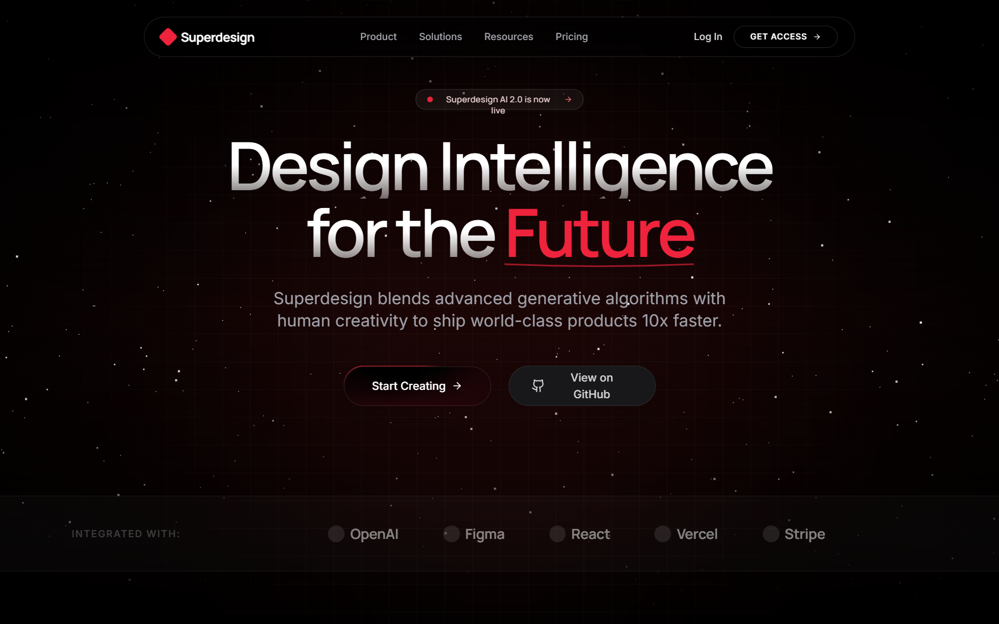

# Design Style: Red Noir Style

> **Source:** [SuperDesign — Red Noir Style](https://app.superdesign.dev/library/red-noir-style)
> **Author:** Zhou Jason
> **Vibe:** A bold, dark-themed landing page featuring high-contrast red accents, glassmorphism, and smooth scro...

## Reference Images

> 이 프롬프트를 사용하면 아래와 같은 스타일로 결과물이 나옵니다.

---

<design-system>

## Design Style: Red Noir Style

### Description

A bold, dark-themed landing page featuring high-contrast red accents, glassmorphism, and smooth scroll animations. Designed for AI and tech products with a futuristic aesthetic.

---

### Reference Implementation

The full HTML reference for this style is stored separately.

**Key Visual Characteristics (from description):**

A bold, dark-themed landing page featuring high-contrast red accents, glassmorphism, and smooth scroll animations. Designed for AI and tech products with a futuristic aesthetic.

</design-system>