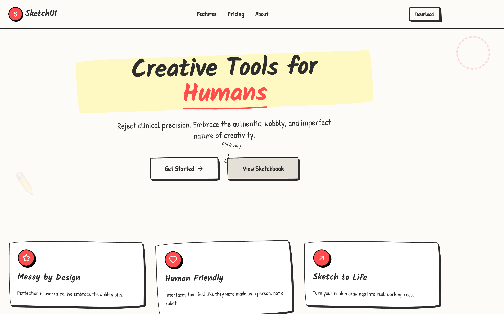

# Design Style: Sketch

> **Source:** [SuperDesign — Sketch](https://app.superdesign.dev/library/sketch)
> **Author:** Zhou Jason
> **Vibe:** The Hand-Drawn design style celebrates authentic imperfection and human touch in a digital world

So...

## Reference Images

> 이 프롬프트를 사용하면 아래와 같은 스타일로 결과물이 나옵니다.

---

<design-system>

## Design Style: Sketch

### Description

The Hand-Drawn design style celebrates authentic imperfection and human touch in a digital world

Source: designprompts.dev

---

### Reference Implementation

The full HTML reference for this style is stored separately.

**Key Visual Characteristics (from description):**

The Hand-Drawn design style celebrates authentic imperfection and human touch in a digital world

Source: designprompts.dev

</design-system>