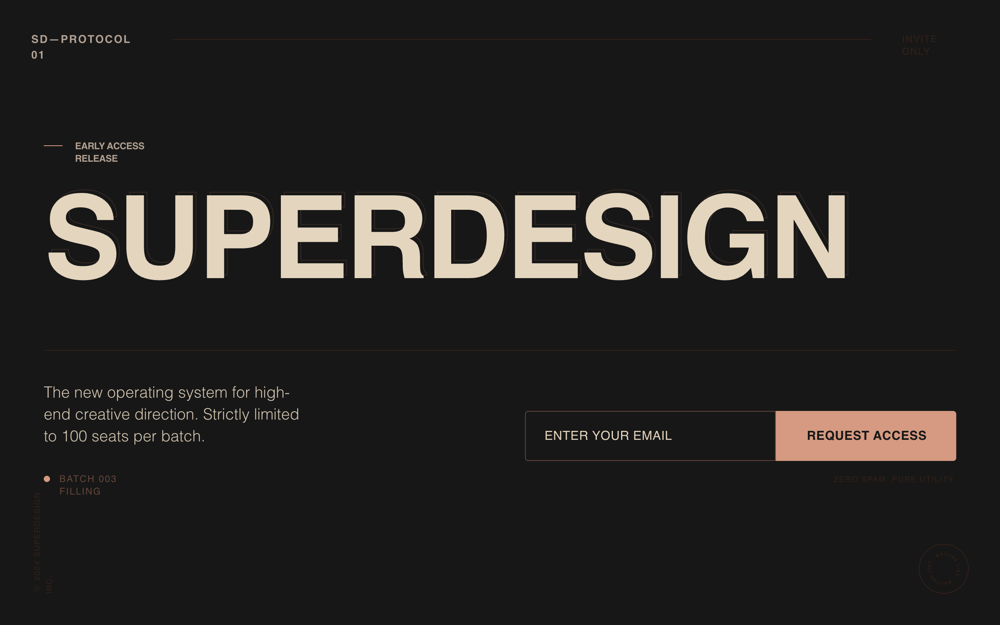

# Design Style: Superdesign Editorial Waitlist

> **Source:** [SuperDesign — Superdesign Editorial Waitlist](https://app.superdesign.dev/library/superdesign-editorial-waitlist)
> **Author:** Shirley Lou
> **Vibe:** A minimalist, editorial-inspired landing page designed to convey 'quiet confidence' and exclusivity....

## Reference Images

> 이 프롬프트를 사용하면 아래와 같은 스타일로 결과물이 나옵니다.

---

<design-system>

## Design Style: Superdesign Editorial Waitlist

### Summary

A minimalist, editorial-inspired landing page designed to convey 'quiet confidence' and exclusivity. It uses a dark matte palette with warm earth-toned accents, oversized uppercase typography, and a distinct lack of traditional SaaS elements like icons or soft shadows. The focus is on typographic impact and a structured grid alignment.

---

### Style

The style is defined by a 'Cinematic Editorial' aesthetic. It uses 'Clash Grotesk' for bold, oversized headlines and 'General Sans' for legible, high-end body copy. Colors are earthy and dark: matte charcoal (#181818), warm beige (#EBDCC4), and coral-rust accents (#DC9F85). A subtle 3% opacity fractal noise overlay provides texture. No pill shapes or gradients; strictly 4px rounded corners and 1px solid borders.

**Core Prompt:**

### Visual Language & Aesthetic
- **Base Theme**: Dark matte editorial. Use `#181818` for the main background.
- **Typography**: 
  - **Display**: Use 'Clash Grotesk' or a similar geometric sans. Headers must be Bold, Uppercase, with `tracking-tight` and `leading-[0.85]`. Desktop size: `11.5vw`. Mobile size: `16vw`.
  - **Body**: Use 'General Sans' or a high-end neo-grotesk. Weight: 300-400 for copy, 500-700 for labels. Text color: `#EBDCC4`.
- **Color Palette**:
  - Primary Background: `#181818` (Matte Black)
  - Primary Text: `#EBDCC4` (Warm Beige)
  - Secondary Text/Labels: `#B6A596` (Muted Sage)
  - Primary Accent/Button: `#DC9F85` (Coral Rust)
  - Borders: `#66473B` (Deep Earth)
  - Dark Details/Dividers: `#35211A` (Burnt Umber)
- **Effects**:
  - **Noise**: Apply a global overlay using a fractal noise SVG at 0.03 opacity.
  - **Borders**: 1px solid borders using `#66473B` or `#35211A`.
  - **Corners**: Subtle rounding only (max 4px radius). No pill shapes.
  - **Depth**: Use a layered text effect with a 1px stroke outline (`#66473B`) offset behind solid text.

---

### Layout & Structure

A vertically structured page with a fixed minimal navigation, an oversized hero section, and a grid-based bottom container for the statement of exclusivity and the email capture form.

#### Minimal Navigation

Create a high-positioned nav bar with absolute positioning. Left side: Small brand ID in `#B6A596`, uppercase, wide tracking (e.g., 'SD—PROTOCOL 01'). Center: A 1px horizontal line in `#35211A` acting as a spacer. Right side: A status label 'INVITE ONLY' in text size 10px-12px, color `#35211A`.

#### Hero Headline Section

Central hero area with edge-to-edge typography. Start with an 'Early Access' label featuring a 24px horizontal line in `#DC9F85` followed by uppercase text in `#B6A596`. The main headline 'SUPERDESIGN' (or generic title) should be oversized (`11.5vw`). Layer a 1px outlined version of the text (`#66473B`) behind the solid beige text, offset by 4px for a depth effect. On mobile, the headline must stack vertically.

#### Bottom Content Grid

Below the hero, place a horizontal divider line in `#35211A`. Below the line, create a 12-column grid. Columns 1-5: Exclusivity statement in `text-xl`, light weight, leading-relaxed. Include a status indicator below it: a 8px circle in `#DC9F85` next to label text 'Batch 003 Filling'. Columns 7-12: Email capture form.

#### Email Capture & Footer

The form should be a unified block. Input field: Transparent background, 1px border `#66473B`, placeholder text `#66473B`, 4px top-left/bottom-left corners. Button: Solid `#DC9F85` background, `#181818` text, bold, uppercase, 4px top-right/bottom-right corners. Add a tiny caption below: 'Zero spam. Pure utility.' in `#35211A`.

---

### Special UI Components

#### Rotating Waitlist Badge

*An animated circular badge indicating current status.*

Place a 64x64px circular component in the bottom-right corner. It consists of a 1px border `#35211A` circle. Inside, animate a text path 'WAITING LIST • WAITING LIST •' rotating infinitely (12s duration). Use font size 11px, bold, uppercase, in `#35211A`.

#### Cinematic Text Layering

*A depth-effect headline style using outlines.*

Implementation: The headline is doubled. Layer 1 (Back): `-webkit-text-stroke: 1px #66473B`, color: transparent, offset by `4px 4px`. Layer 2 (Front): `color: #EBDCC4`. Both layers must share the same font-family, weight, and tracking to align perfectly.

---

### Special Notes

MUST DO: Ensure the background noise overlay is fixed and covers the entire viewport. MAINTAIN strictly tight line-height (0.85) for headlines. MUST NOT: Use gradients, box shadows, or rounded 'pill' buttons. Keep the color palette limited to the specified earthy tones to avoid a generic 'tech' look.

</design-system>