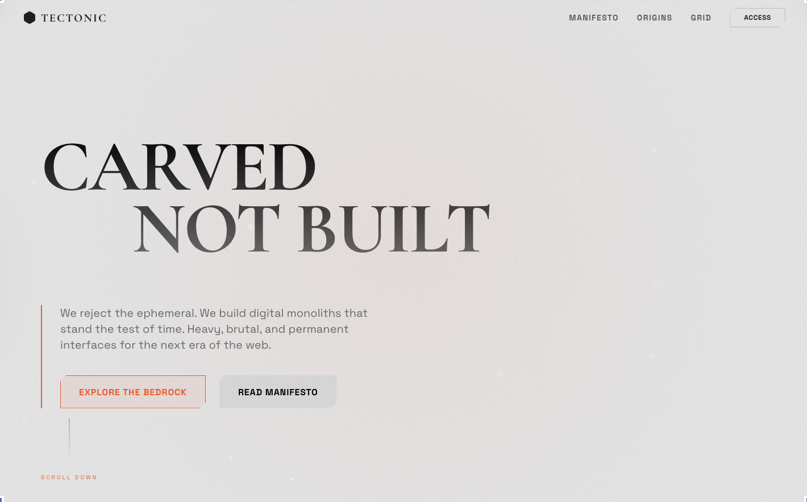

# Design Style: Tectonic style

> **Source:** [SuperDesign — Tectonic style](https://app.superdesign.dev/library/tectonic-style)
> **Author:** Zhou Jason
> **Vibe:** Digital Geology & Obsidian Minimalism...

## Reference Images

> 이 프롬프트를 사용하면 아래와 같은 스타일로 결과물이 나옵니다.

---

<design-system>

## Design Style: Tectonic style

### Description

Digital Geology & Obsidian Minimalism

---

### Reference Implementation

The full HTML reference for this style is stored separately.

**Key Visual Characteristics (from description):**

Digital Geology & Obsidian Minimalism

</design-system>