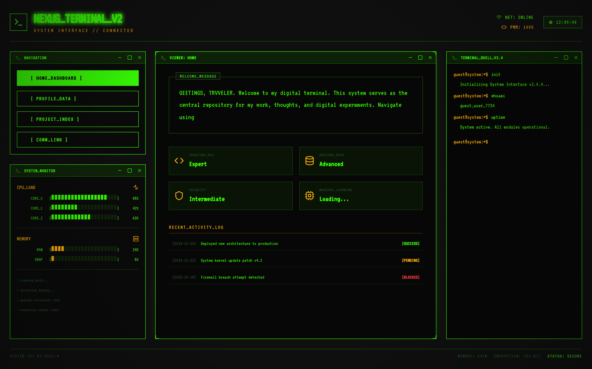

# Design Style: Terminal

> **Source:** [SuperDesign — Terminal](https://app.superdesign.dev/library/terminal)
> **Author:** Zhou Jason
> **Vibe:** The Terminal CLI aesthetic pays homage to the raw power of the command line

Source: designprompt.de...

## Reference Images

> 이 프롬프트를 사용하면 아래와 같은 스타일로 결과물이 나옵니다.

---

<design-system>

## Design Style: Terminal

### Description

The Terminal CLI aesthetic pays homage to the raw power of the command line

Source: designprompt.dev

---

### Reference Implementation

The full HTML reference for this style is stored separately.

**Key Visual Characteristics (from description):**

The Terminal CLI aesthetic pays homage to the raw power of the command line

Source: designprompt.dev

</design-system>